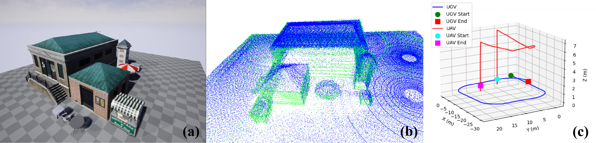
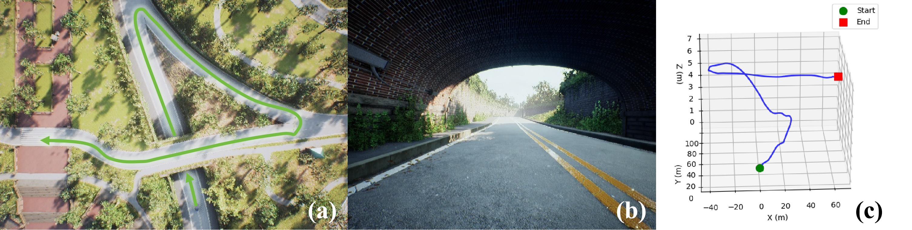
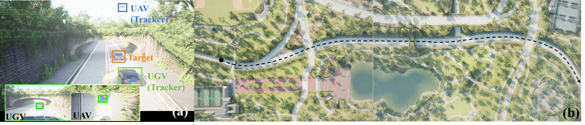
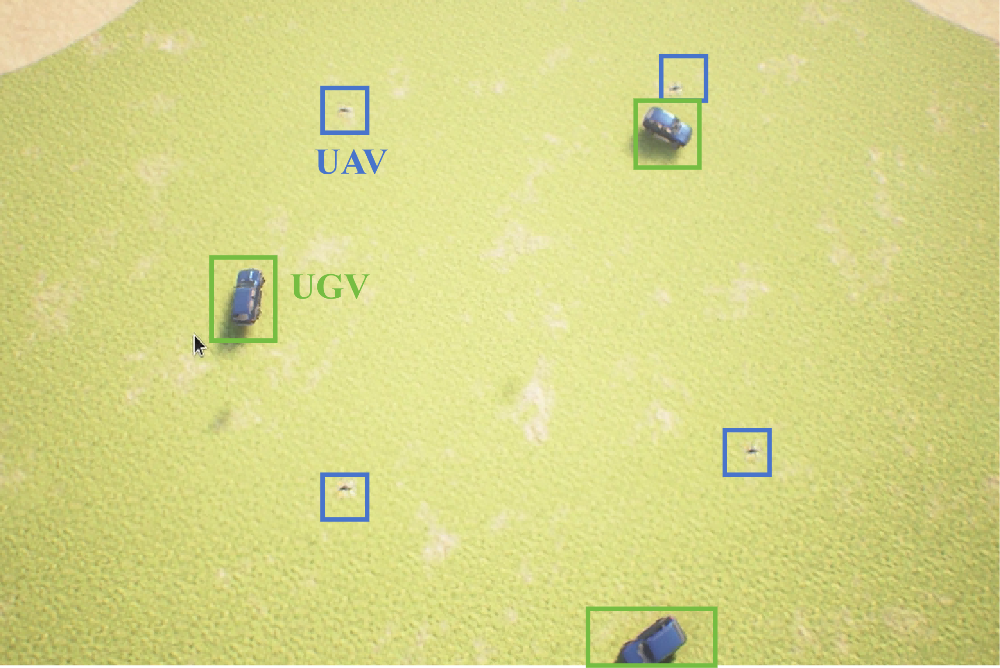

# AirSimAG: Air-Ground Collaborative Simulation Platform

**AirSimAG** (Air-Ground Collaborative Simulation) is an air-ground collaborative simulation platform based on [Microsoft AirSim](https://github.com/Microsoft/AirSim). It provides high-fidelity, physically and visually realistic simulation for joint tasks involving **Unmanned Aerial Vehicles (UAVs)** and **Unmanned Ground Vehicles (UGVs)**. Built on [Unreal Engine](https://www.unrealengine.com/), it supports air-ground collaborative **perception, mapping, planning, tracking, and formation**.

The project aims to become a foundational platform for **air-ground collaborative AI research**, enabling experimentation and validation of deep learning, computer vision, and reinforcement learning algorithms in heterogeneous unmanned systems.

<p align="center">
  
</p>

---

## AirSim-based Enhancements

AirSimAG extends the original AirSim with the following features:

| Feature | Description |
|---------|-------------|
| **Air-Ground Coordination** | Simultaneous simulation of UAVs (multirotor) and UGVs (ground vehicles) in a shared scene |
| **Unified ROS Interface** | Dedicated RPC ports for UAV/UGV with a common ROS Wrapper for message and service APIs |
| **Heterogeneous Sensor Abstraction** | CarSim API and Multirotor API with RGB/Depth/Segmentation cameras, LiDAR, and IMU |
| **Task Stack** | Data collection and algorithm validation for mapping, planning, tracking, and multi-agent formation |

---

## Air-Ground Task Demos

📹 Demo video available in fig_airsimag/AirSimAG.mp4

### 1. Mapping

Cooperative environment mapping using UAV and UGV, with synchronized scene, point cloud, and trajectory visualization.

<p align="center">
  
</p>

### 2. Path Planning

Path planning in complex multi-level scenarios (overpasses, tunnels) with trajectory visualization and analysis.

<p align="center">
  
</p>

### 3. Target Tracking

Air-ground tracking: UAV for global aerial view, UGV for local ground view.

<p align="center">
  
</p>

### 4. Multi-agent Formation

Air-ground formation: four UAVs (square) and three UGVs (circle).

<p align="center">
  
</p>


The multi-agent formation task is performed on a workstation wquipped with an NVIDIA RTX 4090 GPU (24,564 MiB), an Intel Core i7-14700KF CPU, and 62 GB of system memory. The performance metrics during the multi-agent simulation experiment with UE "NoDisplay" mode are as follows:

<div style="text-align: center;">

| Metric | Performance |
|:-------|:-----------:|
| **Num. UAV** | 4 |
| **Num. UGV** | 3 |
| **Frequency of Odometry ROS Topic (Hz)** | >25 |
| **Frequency of Image ROS Topic (Hz)** | >5 |
| **FPS of Unreal Engine Simulation** | 45~60 |
| **Memory Usage of Unreal Engine (MB)** | ~14,852 |

</div>


> **💾 ROS Bag**  
> Pre-recorded rosbag files are available on [Baidu Netdisk](https://pan.baidu.com/s/1k7ELMYJ1HHQqjnw8iYFZTg?pwd=e7jx) (Password: `e7jx`)


---

## Getting Started

### Dependencies

- [Unreal Engine 4.27](https://www.unrealengine.com/)
- [AirSim](https://github.com/Microsoft/AirSim) (as Unreal plugin)
- ROS (optional, for ROS Wrapper and algorithm nodes)

### Resources

- [AirSim Documentation](https://microsoft.github.io/AirSim/)
- Build guides: [Windows](https://microsoft.github.io/AirSim/build_windows) · [Linux](https://microsoft.github.io/AirSim/build_linux)

### Programmatic Control

Using AirSim Python/C++ APIs you can:

- Retrieve RGB, depth, and segmentation images  
- Read LiDAR and IMU data  
- Control UAV and UGV motion and state  
- Integrate via ROS Wrapper  
- Use other AirSim features

---

## Citation

If you use this platform in your academic work, please cite the following papers:

```bibtex
@misc{airsimag2026cui,
      title={AirSimAG: A High-Fidelity Simulation Platform for Air-Ground Collaborative Robotics}, 
      author={Yangjie Cui and Xin Dong and Boyang Gao and Jinwu Xiang and Daochun Li and Zhan Tu},
      year={2026},
      eprint={2603.23079},
      archivePrefix={arXiv},
      primaryClass={cs.RO},
      url={https://arxiv.org/abs/2603.23079}, 
}

@inproceedings{airsim2017fsr,
  author = {Shital Shah and Debadeepta Dey and Chris Lovett and Ashish Kapoor},
  title = {AirSim: High-Fidelity Visual and Physical Simulation for Autonomous Vehicles},
  year = {2017},
  booktitle = {Field and Service Robotics},
  eprint = {arXiv:1705.05065},
  url = {https://arxiv.org/abs/1705.05065}
}


```

---

## License

All rights reserved.
